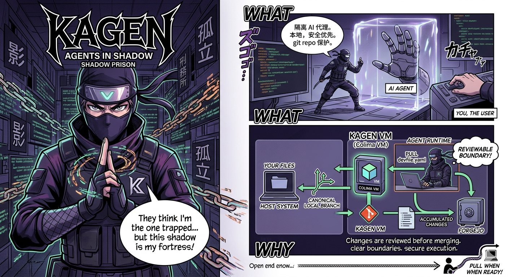

# Kagen



## What
Kagen is a local, security-first agent runtime for Git repositories.

## Why
It isolates AI agents from your host system and the internet. Kagen generates the runtime workload internally and provisions the selected agent inside the Colima VM so the host checkout remains outside the execution boundary.

Changes made by the agent are accumulated in an isolated, in-cluster Forgejo instance. This provides a clear, reviewable boundary before any code is pulled back into your canonical local branch.

## How

Quick docs:
- [Internals Blueprint](docs/INTERNALS-BLUEPRINT.md)
- [Architecture](docs/ARCHITECTURE.md)
- [E2E Scope](docs/E2E.md)
- [Maintainer Checklist](docs/MAINTAINER-CHECKLIST.md)

### Installation

Requires Go 1.26.1, matching `go.mod`.

```bash
git clone https://github.com/pejas/kagen.git
cd kagen
make install
```

### Usage

Write optional repository defaults for Codex (not required before `start` or `attach`):

```bash
kagen config write
```

Rewrite the optional project config with a different default agent:

```bash
kagen config write --agent codex --force
```

Start a new session:

```bash
kagen start codex
```

Attach a new agent session to the most recent ready kagen session for the current repository:

```bash
kagen attach codex
```

List persisted sessions for the current repository:

```bash
kagen list
```

Shut down the whole local Kagen runtime environment:

```bash
kagen down
```

For Codex, Kagen:
- imports the host repository into the in-cluster Forgejo boundary,
- clones that repository into `/projects/workspace` inside the agent pod,
- persists Codex state in a dedicated PVC mounted at `/home/kagen/.codex`,
- launches Codex with `danger-full-access` and `never` approval mode inside the VM, not on the host.

The runtime bootstrap path assumes prebuilt toolbox and proxy artefacts. Pod startup does not install agent CLIs or proxy packages with `apt-get`, `npm install`, or similar package-manager steps.

Existing repository `devfile.yaml` files are treated as legacy repository artefacts: `kagen config write` does not create them, and `kagen start` and `kagen attach` ignore them.

Leaving an agent TUI with `/exit` or `/quit` only detaches from that tool. `kagen config write` only writes optional repo defaults. `kagen down` stops the whole local Colima/K3s runtime environment, while persisted kagen sessions and agent sessions remain in the local store and continue to appear in `kagen list`.

Enable verbose output:

```bash
kagen --verbose
```

With `--verbose`, `kagen start` and `kagen attach` emit a runtime step trace that identifies the active phase, its outcome, and its duration. Failure output names the exact failed step in the top-level error.

Open the review page for the current branch:

```bash
kagen open
```

`kagen open` establishes its own local Forgejo review tunnel and keeps it open until you interrupt the command.

Pull reviewed changes back into the local branch:

```bash
kagen pull
```

`kagen start`, `kagen open`, and `kagen pull` use transient Forgejo transport. They do not persist a credentialed `kagen` remote or ephemeral localhost port into the host repository's `.git/config`.

### Development

Build from source:

```bash
make build
```

Run tests:

```bash
make test
```

Run lint:

```bash
make lint
```

Run the end-to-end suite explicitly:

```bash
make test-e2e
```

Local tooling expected by the checked-in workflow:

- Go matching `go.mod`
- `golangci-lint` v1.64.8 or newer
- `kubectl`
- `colima` for runtime-backed manual or E2E validation

`make test` intentionally excludes `internal/e2e` so the default validation loop stays fast and does not require the full local runtime stack. Use `make test-e2e` when you specifically want end-to-end coverage. The repository CI contract mirrors `make build`, `make test`, and `make lint`.

Runtime artefacts are release-managed. See [docs/RUNTIME-ARTEFACTS.md](docs/RUNTIME-ARTEFACTS.md) for the current image set and update procedure.
The Phase 1 first-party image scaffold lives under `packaging/runtime-images/`, with the default toolbox toolchain declared in `packaging/runtime-images/toolbox/mise.toml` and frozen in `packaging/runtime-images/toolbox/mise.lock`.
